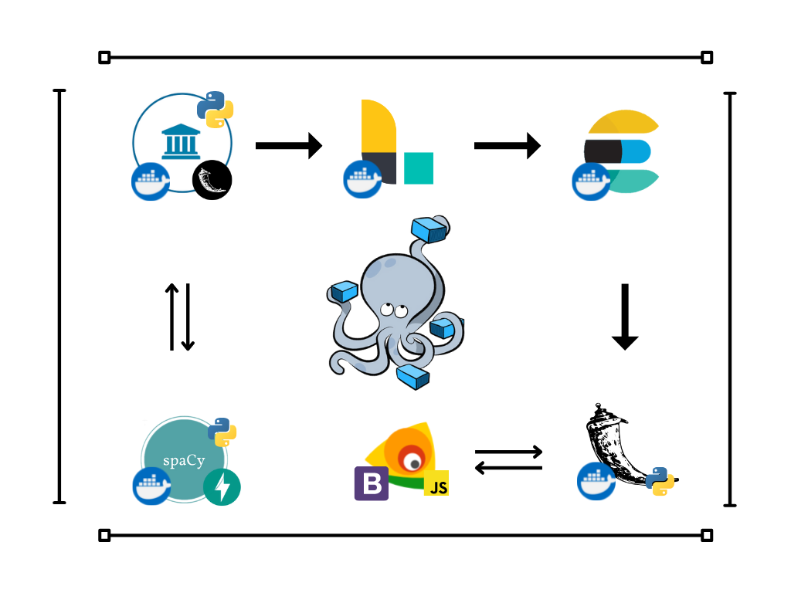
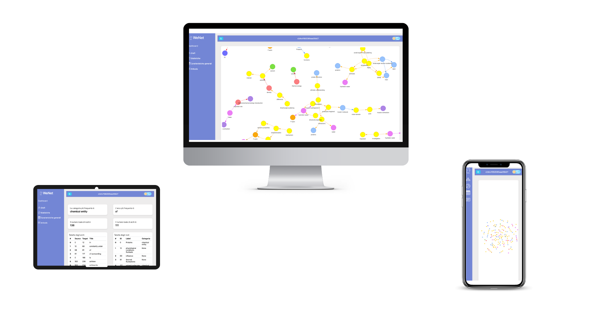
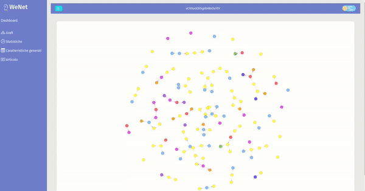

#    WeNet Dashboard
## Introduction
WeNet is a PubMed Central knowledge graph generator based on SciSpacy. The purpose of this project is to create a dashboard for the users of WeNet. 
The main components of the dashboard include, an interface for displaying graphs, a menu for selecting via id the document you want to examine, a frame for displaying a pie chart regarding statistics on the nodes and arcs of the network, and a section that allows you to delve into the categories.labels present in the graph under examination. In addition, there is a section that allows the text of the analyzed paper to be displayed and the entities and relationships extrapolated to create the graph to be highlighted at the click of the mouse

##   Back-end
The back-end of WeNet is based on a real time pipeline developed using Flask and part of the Elastic ELK stack. All the elements are treated as containerized microservices and coordinated by **Docker compose**.

  

### Pipeline

##   PubMed Central repository
  
All the documents are downloaded from the PubMed central Repository and stored in a json (test json at <a href="https://drive.google.com/drive/folders/11jqONNuaLajONQrGrEyS7R5K-US80fYx?usp=sharing">here</a>). 
PubMed is a free search engine accessing primarily the MEDLINE database of references and abstracts on life sciences and biomedical topics. The United States National Library of Medicine (NLM) at the National Institutes of Health maintain the database as part of the Entrez system of information retrieval.
The document's extractions is simulated using a Python Flask server which contains a json with 10000 documents.

##  Spacy
### Industrial-Strength Natural Language Processing
* spaCy is a free, open-source library for advanced Natural Language Processing (NLP) in Python. If you’re working with a lot of text, you’ll eventually want to know more about it. For example, what’s it about? What do the words mean in context? Who is doing what to whom? What companies and products are mentioned? Which texts are similar to each other? spaCy is designed specifically for production use and helps you build applications that process and “understand” large volumes of text. It can be used to build information extraction or natural language understanding systems, or to pre-process text for deep learning.
* "scispaCy is a Python package containing spaCy models for processing biomedical, scientific or clinical text."
* The graph Extraction process is made by a Spacy istance hosted on a **uvicorn Fast API** Rest server.
  

##  LogStash

### Centralize, transform & stash your data

* "Logstash is a free and open server-side data processing pipeline that ingests data from a multitude of sources, transforms it, and then sends it to your favorite "stash".
 
* "Logstash dynamically ingests, transforms, and ships your data regardless of format or complexity. Derive structure from unstructured data with grok, decipher geo coordinates from IP addresses, anonymize or exclude sensitive fields, and ease overall processing".
* Logstash is used to pull documents from the Flask pubmed API. It makes http requests every 1 minute and store them in a elasticsearch index.
### 

##  ElasticSearch

### Search. Observe. Protect.
* "Elasticsearch is a distributed, free and open search and analytics engine for all types of data, including textual, numerical, geospatial, structured, and unstructured".
* "Elasticsearch is a RESTful search and analytics engine  capable of addressing a growing number of use cases. As the heart of the Elastic Stack, it centrally stores your data for lightning fast search, fine‑tuned relevancy, and powerful analytics that scale with ease".
* Elasticsearch is the main data storage components: all the processed documents are directly stored inside elasticsearch by the native logstash plugin.

###   Flask API
* The interface made available to the front end is developed through the flask framework following the rest architecture. The server provides routes, each useful for obtaining information from the client that wants to display a text, its associated graph, or extracted statistics.
* The server is cors-enabled to communicate outside its container.

##    Front-end
The user interface of weNet was created entirely using web technologies and frameworks for responsive display of the dashboard to make it usable from any device. In addition, special javascript libraries were used for the visualization of graphs and diagrams.

##  Bootstrap

* "Powerful, extensible, and feature-packed frontend toolkit. Build and customize with Sass, utilize prebuilt grid system and components, and bring projects to life with powerful JavaScript plugins".
* "Bootstrap utilizes Sass for a modular and customizable architecture. Import only the components you need, enable global options like gradients and shadows, and write your own CSS with our variables, maps, functions, and mixins".
* bootstrap was used for the entire implementation of the page skeleton using the columnar system, this allows the dashboard to adapt to computers, tablets and smatphones, changing its layout as needed.

 

##  Vis.js
* "A dynamic, browser based visualization library. The library is designed to be easy to use, to handle large amounts of dynamic data, and to enable manipulation of and interaction with the data".
* "Network is a visualization to display networks and networks consisting of nodes and edges. The visualization is easy to use and supports custom shapes, styles, colors, sizes, images, and more. The network visualization works smooth on any modern browser for up to a few thousand nodes and edges".
* Vis.js was mainly used for visualizing graphs from the extracted entities and relationships, represented by nodes and edges respectively.

##  Google Charts
* "Google chart tools are powerful, simple to use, and free which provides Interactive charts for browsers and mobile devices".
* Google chart was used to describe the categories of nodes within the graph.

## Try it out
* Move to the main directory of the project and type **docker-compose up** (don't forget to download the articles-bulk.json file from google drive).
* open the **index.html** file with your favourite browser and enjoy it.

 

## Authors 

* [Rosario Cannavò](https://github.com/rosariocannavo)
* [Mario Benissimo](https://github.com/mariobenissimo) 

